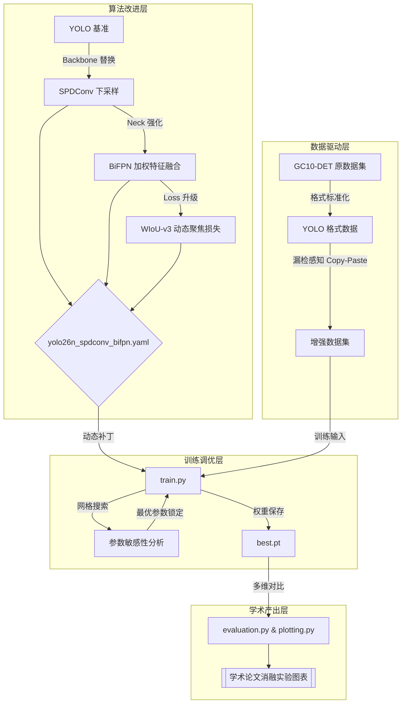

# 基于改进 YOLO 算法的零部件缺陷视觉检测方法研究

本项目是《基于改进 YOLO 算法的零部件缺陷视觉检测方法研究》的毕业设计配套源码库。本项目针对工业场景下小目标缺陷易漏检、数据不平衡等痛点，提出了基于 **SPDConv**、**BiFPN** 与 **WIoU-v3** 的增强型检测架构。

---

## 🚀 核心改进逻辑 (Architectural Logic)

1.  **物理保真 (SPDConv)**: 引入 Space-to-Depth 机制替代跨步卷积，在下采样时保留微小目标的像素级特征。
2.  **尺度裁判 (BiFPN)**: 采用带学习权重的加权特征融合，自适应对齐多尺度缺陷的语义与位置信息。
3.  **动态降噪 (WIoU-v3)**: 通过非单调聚焦机制抑制低质量标注（脏数据）梯度，平衡 Recall 与 Precision。

---

## 📊 项目逻辑架构 (System Architecture)

### 1. 深度检测管线逻辑 (Workflow)


---

## 📂 目录结构与脚本

| 文件夹/脚本 | 用途说明 |
| :--- | :--- |
| **`models/`** | **核心架构定义目录**。 |
| ├── `modules/` | 包含 `spdconv.py` (下采样)、`fpn_pafpn.py` (BiFPN) 等改进算子。 |
| └── `yolo26n_*.yaml` | 不同的模型网络配置文件，定义了层级拓扑结构。 |
| **`utils/`** | **辅助工具包**。 |
| ├── `loss.py` | `WIoU_Loss` 的核心算法实现。 |
| ├── `metrics.py` | 用于计算 Params 和 FLOPs 的评估工具。 |
| └── `grid_search.py` | 自动化参数敏感性分析脚本。 |
| **`datasets/`** | **数据处理目录**。 |
| ├── `convert_voc_to_yolo.py` | 将原始 VOC XML 转化为归一化的 YOLO TXT 格式，并修复拼写错误。 |
| ├── `augment_dataset.py` | 针对罕见/漏检类别的专项增强脚本 (Copy-Paste 策略)。 |
| └── `visualize_aug.py` | 增强效果可视化预览工具。 |
| **`eval/`** | **评估产出目录**。 |
| ├── `evaluation.py` | 自动扫描 `runs/` 目录，生成 mAP、Params、FLOPs 的对比 CSV。 |
| ├── `plotting.py` | 绘制学术级的 Loss 收敛曲线和 mAP 演进曲线对比图。 |
| └── `output/` | (Ignored) 存放生成的对比报表与高清图表。 |
| **`train.py`** | **主训练入口**。支持 WIoU 动态注入、动态路由及超参 CLI 覆盖。 |
| **`val.py`** | **主验证脚本**。用于在测试集上运行全面评估。 |

---

## 📦 数据集

### 1. GC10-DET 数据集
GC10-DET 是由北京科技大学收集的大型钢铁表面缺陷数据集，包含 10 类典型工业缺陷。原始数据采用 VOC 格式，子目录结构复杂且存在部分中文/错别字。

### 2. 获取方式
本项目使用的 YOLO 格式标准化数据集已发布至 Google Drive：
🔗 [GC10-DET-YOLO.tar.gz](https://drive.google.com/file/d/1fQSzI0SICm0y7_hUZDpxT8dZwLw85XSE/view?usp=sharing)
下载后解压至 `datasets/` 目录，确保结构如下：
```text
datasets/GC10-DET-YOLO/
├── images/ (train/val/test)
├── labels/ (train/val/test)
└── data.yaml
```

### 2. 数据处理与增强脚本
*   **`datasets/convert_voc_to_yolo.py`**: 如果你持有的是 VOC XML 原数据，运行此定制脚本进行转换。它内置了拼写错误自动修复逻辑。
*   **`datasets/augment_dataset.py`**: **数据集增强脚本**。为了因对数据集样本数量差异过大、部分缺陷类别样本多样性低/样本数量过少。它采用“漏检感知 Copy-Paste”策略，通过动态监测类别实例数，将高漏检风险的小样本类别（如轧坑、折痕）自动合成到不同背景中，大幅缓解长尾分布问题。
    ```bash
    uv run datasets/augment_dataset.py
    ```

---

## ⚡ 快速开始

### 1. 环境构建与数据部署
```bash
git clone https://github.com/your-username/defect_detection_yolo.git
cd defect_detection_yolo
uv sync  # 同步环境
# [下载数据集并解压到 datasets/ 目录下]
```

### 2. 消融实验命令示例
| 实验阶段 | 对应命令 |
| :--- | :--- |
| **Baseline** | `uv run train.py --cfg yolo26n.pt --name 01_exp_baseline` |
| **+ SPDConv** | `uv run train.py --cfg models/yolo26n_spdconv_only.yaml --name 03_exp_spdconv` |
| **+ BiFPN** | `uv run train.py --cfg models/yolo26n_spdconv_bifpn.yaml --name 04_exp_spdconv_bifpn` |
| **+ WIoU-v3 (采用 Grid Search 最佳参数)** | `uv run train.py --cfg models/yolo26n_spdconv_bifpn.yaml --wiou --wiou_alpha 1.6 --wiou_delta 2.5 --name 05_exp_final_original` |
| **SPDConv + BiFPN + WIoU-v3 架构优化、增强版数据集** | `uv run train.py --cfg models/yolo26n_spdconv_bifpn.yaml --data datasets/GC10-DET-YOLO-AUGMENTED/data.yaml --epochs 150 --wiou --wiou_alpha 1.6 --wiou_delta 2.5 --name final_exp_augmented` |

### 3. 结果分析
脚本将自动扫描 `runs/train/` 下的所有子目录（训练结果）：
```bash
# 生成指标对比表 (mAP, Params, FLOPs)
uv run eval/evaluation.py
# 绘制所有实验的对比曲线 (Loss, mAP)
uv run eval/plotting.py
# 一键提取所有实验的核心混淆矩阵与 PR 曲线
uv run utils/thesis_helper.py
```
所有分析结果将统一保存在 `eval/output/` 目录下。
