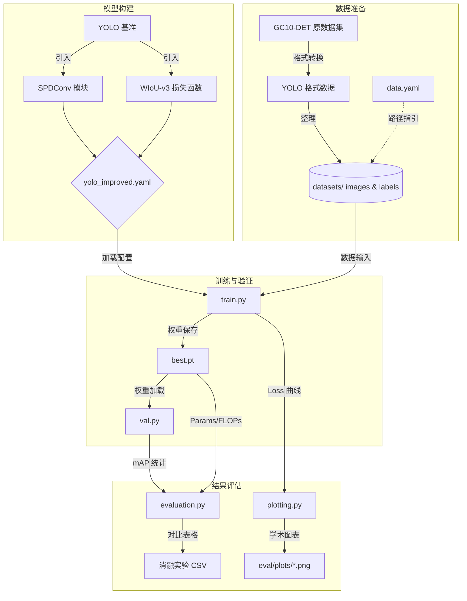
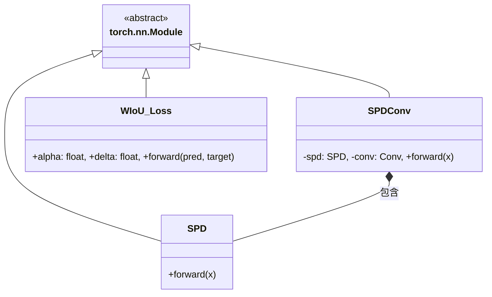
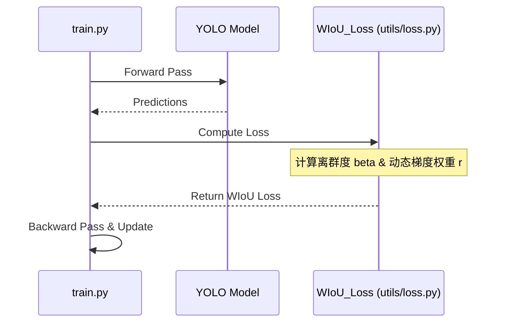

# 基于改进 YOLO 算法的零部件缺陷视觉检测方法研究

本项目是《基于改进 YOLO 算法的零部件缺陷视觉检测方法研究》的毕业设计源码库。本研究致力于解决工业零部件（如钢带、绝缘子等）质量检测中存在的小目标缺陷特征易丢失、数据集样本不平衡以及噪声标注干扰等问题。

## 主要改进点

1. **SPDConv (Space-to-Depth Convolution)**: 
   在主干网络中替换传统的步长卷积和池化层，将空间信息整合到通道维度，避免小缺陷特征在下采样和深层网络中丢失。
1. **WIoU-v3 损失函数**: 
   引入动态非单调聚焦机制，根据训练动态调整梯度分配，优先优化高质量样本，抑制低质量样本（噪声标注）的负面影响。
1. **BiFPN (Feature Pyramid Network)**: 
   优化了特征金字塔架构以进行跨尺度的特征融合，改善小目标的上下文语义联系。

## 项目架构与工作流

以下图表描述了数据流向、模块关系及模型训练的整体管线。

### 1. 整体管线逻辑 (Flowchart)


### 2. 改进模块结构 (Class Diagram)


### 3. 训练损失计算流程 (Sequence Diagram)


## 项目目录结构

* `docs/`: 包含超参数调优指南 (`hyperparameter_tuning_guide.md`)。
* `models/`: 包含改进模块 (`SPDConv`, `FPN_PAFPN` 等) 和自定义的网络配置文件 `yolo_improved.yaml`。
* `utils/`: 包含 `WIoU_Loss` 损失函数和评估指标脚本。
* `eval/`: 包含用于毕业论文的消融实验对比图表生成脚本 (`evaluation.py`, `plotting.py`)。
* `datasets/`: 存放数据集 (默认需要 YOLO 格式)。
* `train.py` & `val.py`: 端到端的训练与验证脚本。

## 快速开始

### 1. 环境准备

本项目使用 `uv` 进行环境管理。

```bash
uv sync
# or using the pip-compatible interface: `uv pip install -r pyproject.toml`
```

或直接通过 pip 安装依赖：

```bash
pip install ultralytics pandas matplotlib seaborn thop # Ultralytics 库已包含绝大多数依赖
```

### 2. 准备数据

将你的数据集组织为标准的 YOLO 格式，并修改 `datasets/data.yaml` 文件中的路径和类别数。
如果有 VOC 格式数据，可以使用根目录下的 `convert_voc_to_yolo.py` 转换。

### 3. 模型训练

使用改进的 `yolo_improved.yaml` 和定制的超参数开始训练：

```bash
uv run train.py --cfg models/yolo_improved.yaml --data datasets/data.yaml --epochs 100 --batch 16
```

*(关于如何针对缺陷数据集调整初始学习率和 WIoU 参数，阅读 `docs/hyperparameter_tuning_guide.md`)*

### 4. 模型评估与测试

验证训练好的模型：

```bash
uv run val.py --weights runs/train/exp_improved/weights/best.pt --data datasets/data.yaml
```

### 5. 生成论文图表 (消融实验)

当分别训练了 `Baseline` 和加入了各个模块的模型后，修改 `eval/evaluation.py` 和 `eval/plotting.py` 中的目录路径字典，然后运行：

```bash
uv run eval/evaluation.py
uv run eval/plotting.py
```

这将在 `eval/plots/` 目录下生成用于论文的高清收敛曲线对比图和包含 Params/FLOPs 的指标表格。